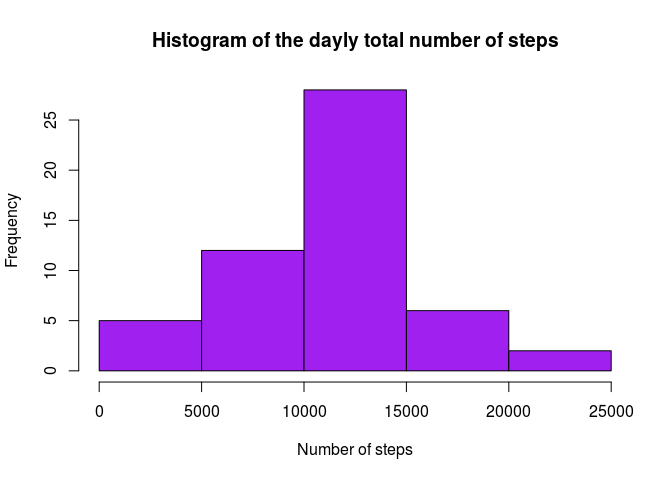
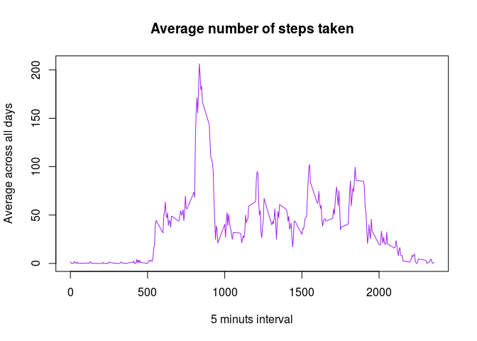
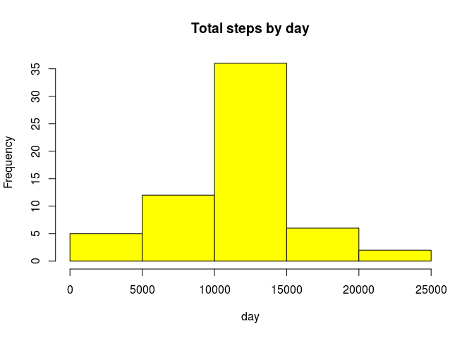
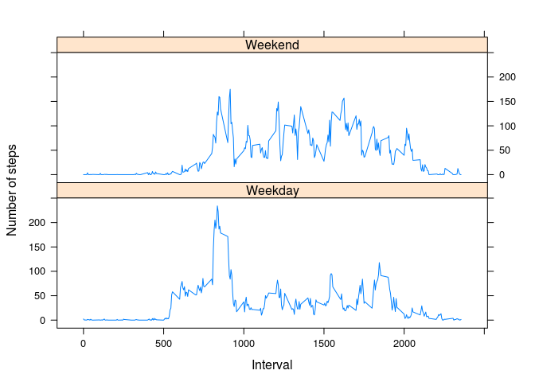

# Reproducible Research: Peer Assessment 1
 

First, I set the value of `echo` equal to `TRUE` globally. Note that (at least in my software distribution) I need to load the library `knitr` 


```r
require(knitr)
```

```
## Loading required package: knitr
```

```r
opts_chunk$set(echo = TRUE)
```

## Loading and preprocessing the data
Assume that 

 1. the data file called activity.csv available at the same directory as this Markdown document
 2. the working directory is has been set to such a directory
 
Thus, **load the data**


```r
activity <- read.csv(file = "activity.csv", colClasses = c("numeric", "character", "numeric"))
# If the data is zipped, just uncomment the following line
# unzip("activity.zip")
```

and see what it looks like


```r
head(activity)
```

```
##   steps       date interval
## 1    NA 2012-10-01        0
## 2    NA 2012-10-01        5
## 3    NA 2012-10-01       10
## 4    NA 2012-10-01       15
## 5    NA 2012-10-01       20
## 6    NA 2012-10-01       25
```


## What is mean total number of steps taken per day?

In this part of the assignment  the missing values in the dataset are ignored, so that I first 
subset the not `Na` values.  


```r
activity.clean <- activity[which(!(activity$steps %in% NA)), ]
```

Next, I calculare **the total number of steps taken per day** 
all along the days with records (i.e., days such that the value of activity$steps is not `Na`)


```r
dayly.steps <- aggregate(steps ~ date, data = activity.clean, FUN=sum)
colnames(dayly.steps) <- c("date", "steps")
```


```r
# In case you want to display the above referred total number of steps taken per day, 
# uncomment the next code line
# (dayly.steps)
```


Now, I plot a **histogram** of the total number of steps taken each day


```r
hist(dayly.steps$steps, main = "Histogram of the dayly total number of steps",  xlab = "Number of steps", col = "purple" )
```

 


Regarding the **mean** and the **median**, 

```r
(meanvalue <- mean(dayly.steps$steps))
```

```
## [1] 10766.19
```

```r
median(dayly.steps$steps)
```

```
## [1] 10765
```


## What is the average daily activity pattern?

I plot a **time series plot** (i.e. type = "l") of the 5-minute interval (x-axis) and the average number of  steps taken, averaged across all days (y-axis)


```r
time.series <- tapply(activity$steps, activity$interval, mean, na.rm = TRUE)
plot(row.names(time.series), time.series, type = "l", xlab = "5 minuts interval", 
    ylab = "Average across all days", main = "Average number of steps taken", 
    col = "purple")
```

 

The **5-minute interval that contains the maximum  number of steps**, on average across all the days in the dataset, is 


```r
max.interval <- which.max(time.series)
names(max.interval)
```

```
## [1] "835"
```

## Imputing missing values
Next, I **calculate and report the total number of missing values** in the dataset (i.e. the total number of rows with NAs)


```r
sum(is.na(activity))
```

```
## [1] 2304
```

The presence of missing days (i.e.`Na`) may introduce bias into some calculations or summaries of the data. As suggested, I have devised a strategy for filling in all of the missing values in the dataset.  Namely, I have decided fill each missing value with the average 
number of steps for that interval


```r
fill.na <- numeric()
average.steps <- aggregate(steps ~ interval, data = activity, FUN = mean)
for (i in 1:nrow(activity)) {
    obs <- activity[i, ]
    if (is.na(obs$steps)) {
        steps.aux <- subset(average.steps, interval == obs$interval)$steps
    } else {
        steps.aux <- obs$steps
    }
    fill.na <- c(fill.na, steps.aux)
}
```


Then, I create a new dataset that is equal to the original dataset but with the missing data filled in.


```r
new.activity <- activity
new.activity$steps <- fill.na
```

Now I will make a histogram of the total number of steps taken each day. 
I first calculate 


```r
dayly.steps.2 <- aggregate(steps ~ date, data = new.activity, sum, na.rm = TRUE)
```

and display the histogram is


```r
hist(dayly.steps.2$steps, main = "Total steps by day", xlab = "day", col = "yellow")
```

 


Now, I **calculate and report the mean and median** total number of steps taken per day: 


```r
mean(dayly.steps.2$steps)
```

```
## [1] 10766.19
```


```r
median(dayly.steps.2$steps)
```

```
## [1] 10766.19
```

## Are there differences in activity patterns between weekdays and weekends?

In this section I will use the `weekdays()` function. Now I work wih the dataset with the filled-in missing  values. 
I will create a new factor variable in the dataset with two levels,– “weekday” and “weekend,” indicating whether a given date is a weekday or weekend day.


```r
day <- weekdays(as.Date(data$date))
daylevel <- vector()
for (i in 1:nrow(activity)) {
    if (day[i] == "sábado") { # don't know why my system uses Spanish weekday names
        daylevel[i] <- "Weekend"
    } else if (day[i] == "domingo") {
        daylevel[i] <- "Weekend"
    } else {
        daylevel[i] <- "Weekday"
    }
}
activity$daylevel <- daylevel
activity$daylevel <- factor(activity$daylevel)

stepsByDay <- aggregate(steps ~ interval + daylevel, data = activity, mean)
names(stepsByDay) <- c("interval", "daylevel", "steps")
```

Finally, I will make a panel plot containing a time series plot (i.e. type = “l”) of the 5-minute interval (x-axis) and the average number of steps taken, averaged across all weekday days or weekend days (y-axis): 

```r
require(lattice)
```

```
## Loading required package: lattice
```

```r
 xyplot(steps ~ interval | daylevel, stepsByDay, type = "l", layout = c(1, 2), 
     xlab = "Interval", ylab = "Number of steps")
```

 


